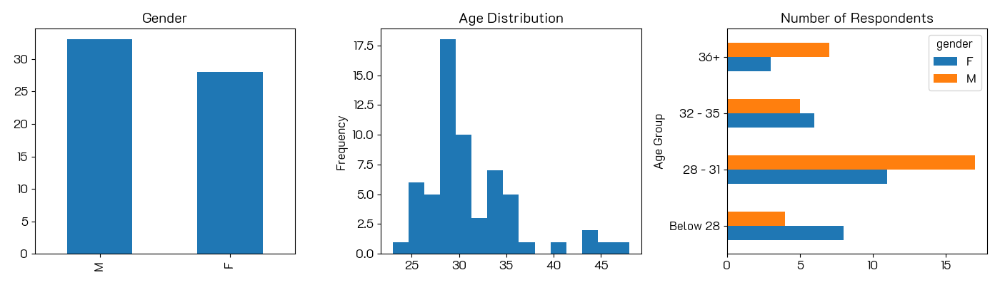
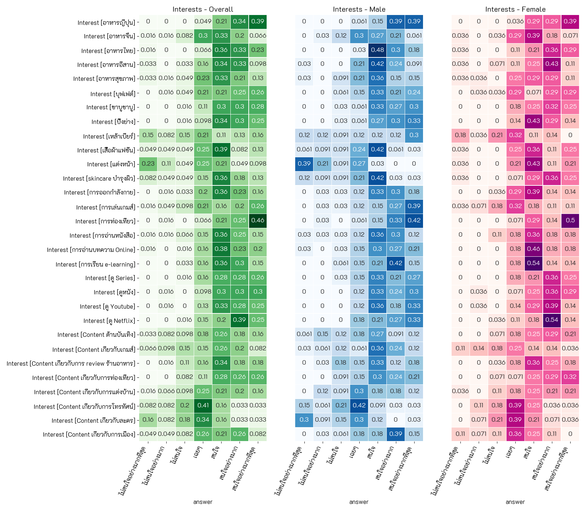
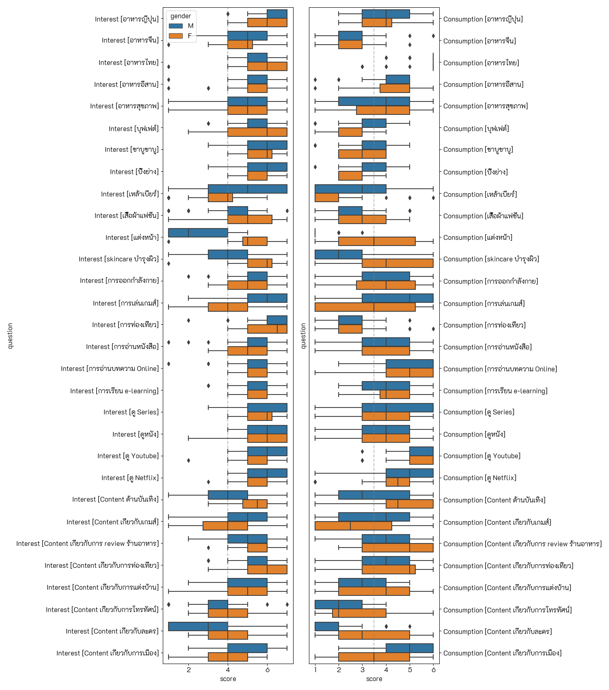
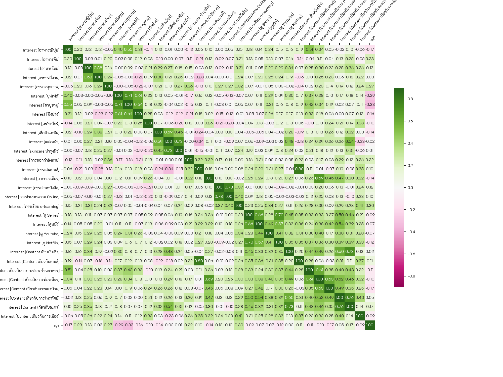
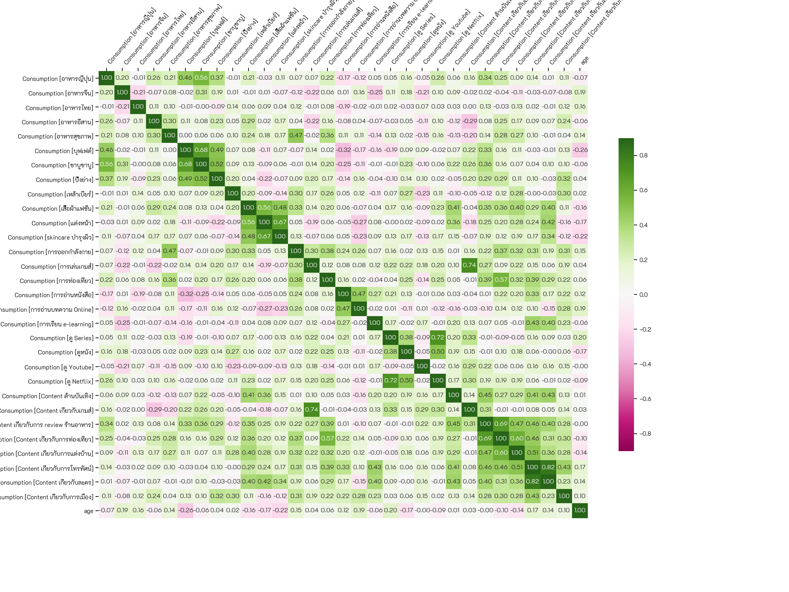

# Customer Behaviors

## Dataset  
A survey asking about interests and consumptions of 30 things, e.g., Japanese food, Thai food, Gaming, Cosmetics. The respodents are the students from the class.

**Notebook:** [Analysis of customer behaviors](./hw01-customer-behaviors.ipynb)  
**Google Colab:** 

Example of the result  
## Demographic

## Frequency
Normalized as percentage count for each question
### Interests

### Consumptions

## Side-by-Side Distribution
Comparing distributions of the responses of interest and consumption on the same topic.  

## Correlation of Interests

## Correlation of Consumptions

