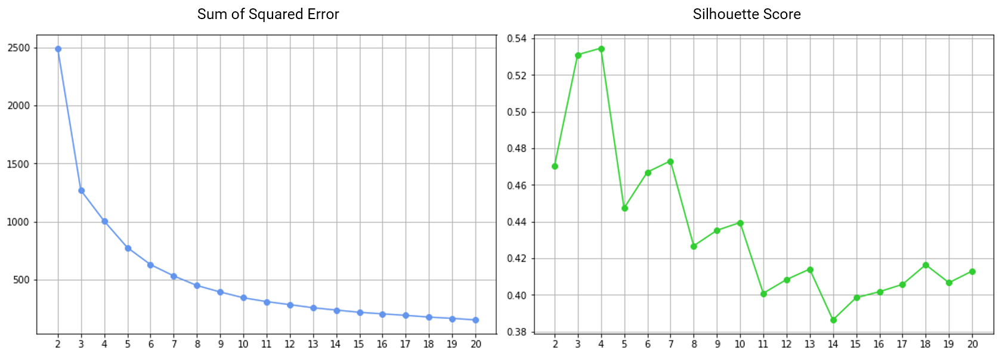
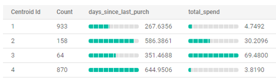
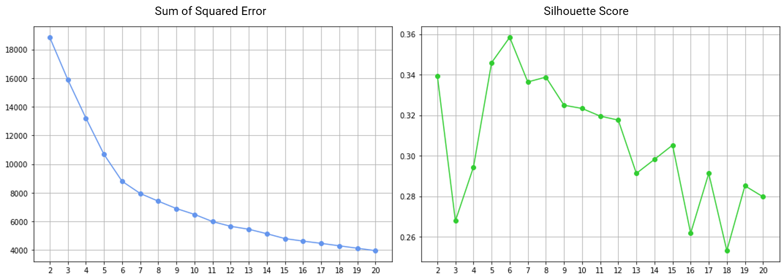
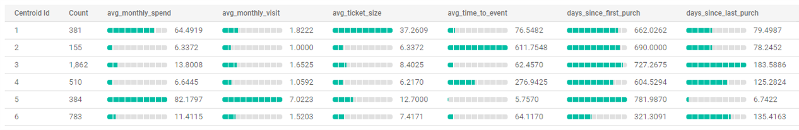

# Customer Segmentation

The diagram below describes how this project was implemented.

## 1) Import Dataset
The given Supermarket dataset contains 956K rows of sales transactions at sales-item level. Import the file into Google BigQuery.  
  
**Note:** the dataset received is just a part of Dunhumbly public dataset which is way more bigger. There seems to be historical data from only 2 stores from year 2006 to 2008.  

## 2) Generate Customer Single View
From `transactions` table, aggregate data to basket and customer level into `baskets` and `customers` tables respectively.  
* Create `baskets` table using [create-baskets.sql](./create-baskets.sql)  
only baskets of members are included (`transactions.cust_code is not null`)  
* Create `customers` table using [create-customer-single-view.sql](./create-customer-single-view.sql)  
generated a lot features, but decided not to use them.  
  
**Note:** the `age` of basket (in days) was calculated against the last transaction date of the dataset. If we use the current date (in 2021) to calculate, the difference in ages of all transactions would be rather smaller comparing to using the backdate.  

## 3) K-Means Clustering using BigQuery ML
By looking into the data, I found that the number of customers having only one transaction is 2,025, one-third of all customers. The rest of 4,075 customers have at least 2 transactions.  

Some of generated features are only applicable to multiple transactions. For example, you need at least 2 transactions to calculate time-to-event (average duration between transactions). Also, with only one transaction, many features have the same value, e.g., duration from first & last transactions, average ticket size & average montly spend, etc.  
  

### 3.1) Single-Purchase Customer Clustering
Create KMean model using *BigQuery ML* with [bq-ml-kmeans-single-purchase-customers.sql](./bq-ml-kmeans-single-purchase-customers.sql)  

#### Features
* `days_since_last_purch` : duration in days from the last transaction. This represents *Recency* in RFM analysis
* `total_spend` : sum of all spend. This represents *Monetary* in RFM analysis

#### Choosing K number of clusters
Choose `K = 4`

#### Clustering Result
Centroid value for each feature from BigQuery UI.

### 3.2) Repeat-Purchase Customer Clustering
Create KMean model using *BigQuery ML* with [bq-ml-kmeans-repeat-purchase-customers.sql](./bq-ml-repeat-purchase-customers.sql)  

#### Features
* `avg_ticket_size` : average of total spending over all transactions, representing *Monetary* in RFM analysis.
* `avg_monthly_spend` : average of total spending over all 'active' months, representing *Monetary* in RFM analysis.
* `avg_monthly_visit` : average of total transactions over all 'active' months, representing *Frequency* in RFM analysis.
* `days_since_first_purch` : duration in days from the first transaction, representing *Tenure*.
* `days_since_last_purch` : duration in days from the last transaction, representing *Recency* in RFM analysis.
* `avg_time_to_event` : duration in days between 2 transactions (events), representing *Frequency* in RFM analysis.

#### Choosing K number of clusters
Choose `K = 6`

#### Clustering Result
Centroid value for each feature from BigQuery UI.

## 4) Clustering Result Analysis

## 5) Interpretation

