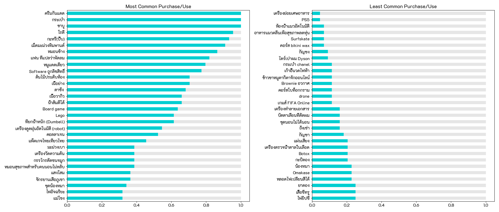
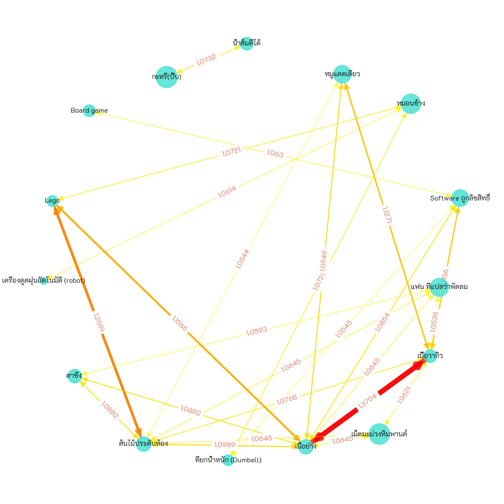
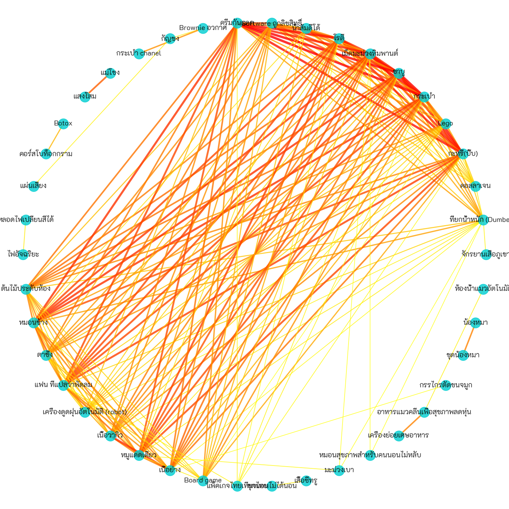
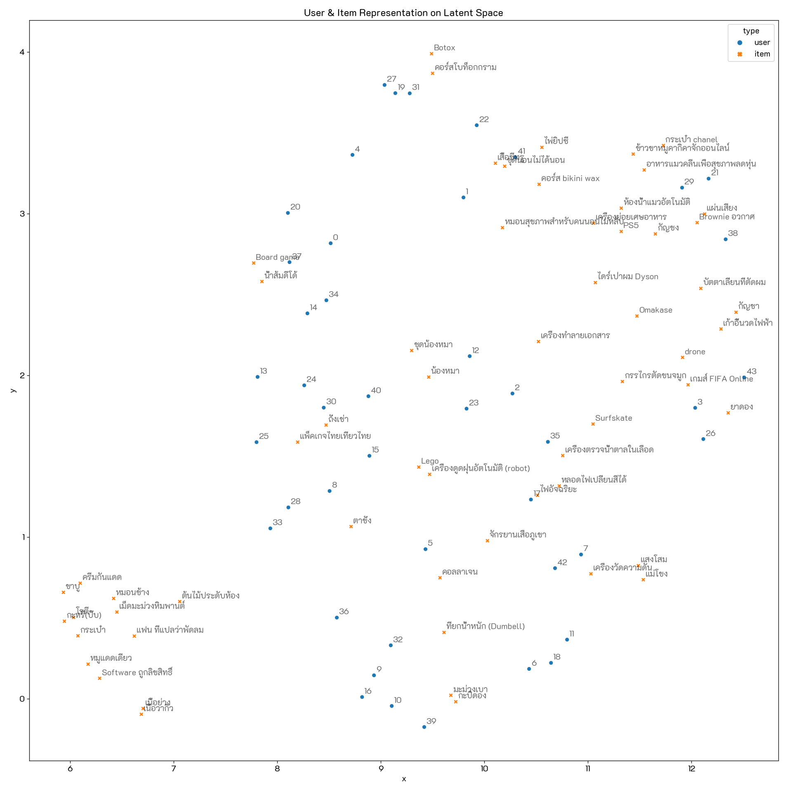
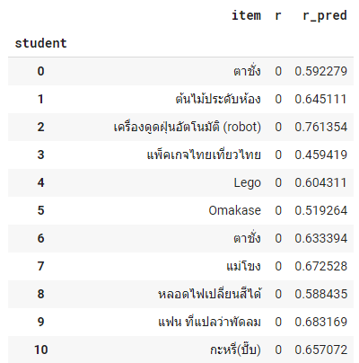

# Product Recommendation
      
## Dataset 📊  
A survey asking whether or not the user (students from the class) has ever purchased/used an item. We received 44 responses, and each respondent rated each item from 60 items as Yes or No.

**Notebooks:** [Product recommendation](./hw07-product-recommendation.ipynb)  
**Google Colab:**   

## Top Most/Least common items
To see how common (ever purchased by users) each item is. Count of users who rated yes for each item normalized to [0,1] scale.

## Association Rules
Running a market basket analysis. Here's the visualzation of 1-itemset association rules (filtered by Support > 0.5 and Lift > 1.05)  
Nodes represent items and directed edges represent rules (antecedents ➞ consequents). Edge labels annotates Lift values.
Note that for 1-to-1-itemset, both directions of rules (A➞B, B➞A) have the same lift values, so in the case, we always have bi-directional edges (A⬌B).

## Collaborative Filtering - Item Similarity
By using users' ratings for each item as its feature vector, calculates cosine similarity values for each pair of items. We could recommend items based on item similarity.  
Filtering the similarity using 0.65 threshold, and visualize them in graph. A node represents an item. Edge thickness and color represent cosine similarity between 2 items.  

## Matrix Factorization
Using NMF to decompose the Utility Matrix, we then get the mapping of users and items to the concepts in latent space. Both users and items can be visualized in the same Latent space as below. Similar items/users are close to each other.

Reconstruct the decomposed matrices (user & item matrices) gives the predicted rating. In this case, recommendation can be made using the item with the highest predicted rating score for each user.  

