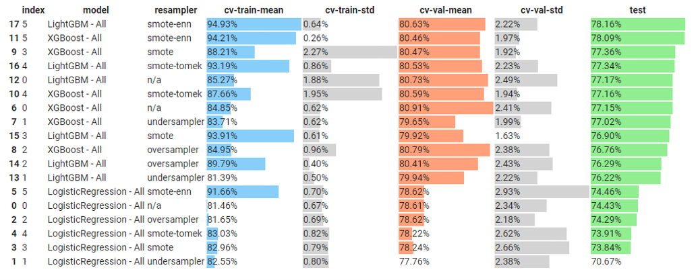
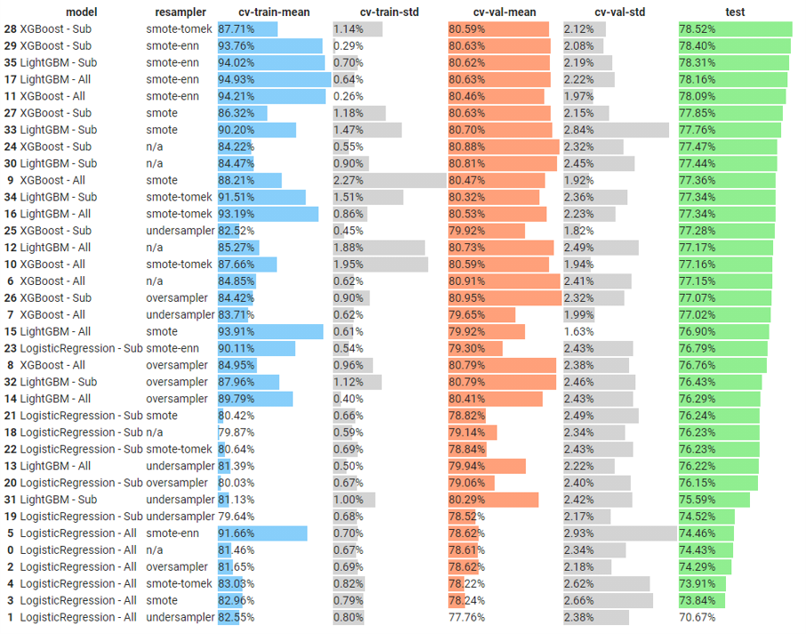

# Campaign Response Model
        

## Dataset 📊  
A Retail-like dataset consisting of CUSTOMER_ID, TRANS_DATE, TRANS_AMOUNT which is on customer's basket level.  

**Notebooks:** [Campaign Response Model](./hw08-campaign-response-model.ipynb)  
**Google Colab:**   

## What I did
* Additional feature engineering
* Cross-validation training sets using StratifiedKFold to evaluate models
* Evaluate models choosing from a combination of 
  * Models: LogisticRegression, XGBoost, LightGBM
  * Dataset: using all features or a selective set
  * Resampling: undersampling, oversampling, SMOTE, SMOTE+TOMEK Links, SMOTE+ENN
* Feature selection using Recursive Feature Elimination, Lasso, Tree-based
* Hyperparameter tuning using Optuna

## 1) Feature Engineering

Originally, only Recency, Frequency, and Monetary features are given with test-auc score around 0.70 ~ 0.72. Below features are additionally generated.
  * Tenure, Length of stay
  * Time to event (mean/stddev of time between repeated transactions)
  * Monetary, Frequency, Ticket Size, Time to event for the past 6, 12, 18, 24 months
  * Velocity of spending for the short period over longer period, e.g, 12 over 24 months  

## 2) Evaluate models (1st round)
Using all generated features with Logistic Regression, XGBoost and LightGBM models and various resampling methods, i.e., undersampling, oversampling, SMOTE, SMOTE (upsampling) + TOMEK Links (undersampling), SMOTE (upsampling) + ENN (undersampling).  
By cross-validating the training set, mean/stddev of train-auc and validation-auc scores are provided including test-auc score.

- XGBoost and LightGBM outperforms Logistic Regression
- SMOTE-family resampling gives better scores

## Cohort Analysis

## Model Selection

## Result

## Feature Importance

## SHAP Tree Explainer

## Future Improvements
* Proper model evaluation by using train, validation, and test split including cross validation.  
an expert suggests that this seems overfitting to the test-set
* SHAP Tree Explainer interpretation
* Proper Feature Selection
* Hyperparamter tuning, maybe Optuna
