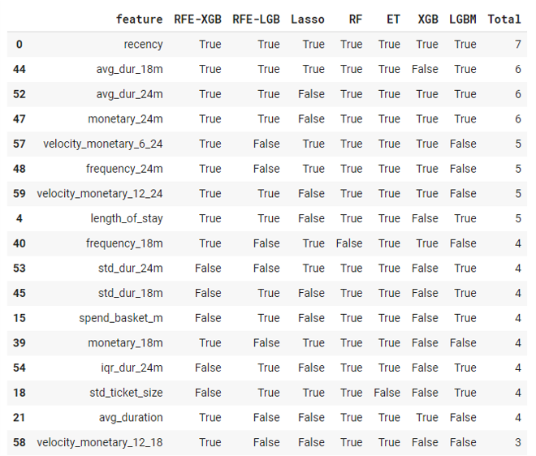

# Campaign Response Model
        

## Dataset 📊  
A Retail-like dataset consisting of CUSTOMER_ID, TRANS_DATE, TRANS_AMOUNT which is on customer's basket level.  

**Notebooks:** [Campaign Response Model](./hw08-campaign-response-model.ipynb)  
**Google Colab:**   

## What I did
* Additional feature engineering
* Cross-validation training sets using StratifiedKFold to evaluate models
* Evaluate models choosing from a combination of 
  * Models: LogisticRegression, XGBoost, LightGBM
  * Dataset: using all features or a selective set
  * Resampling: undersampling, oversampling, SMOTE, SMOTE+TOMEK Links, SMOTE+ENN
* Feature selection using Recursive Feature Elimination, Lasso, Tree-based
* Hyperparameter tuning using Optuna  

## EDA
### Cohort Analysis

## 1) Feature Engineering

Originally, only Recency, Frequency, and Monetary features are given with test-auc score around 0.70 ~ 0.72. Below features are additionally generated.
  * Tenure, Length of stay
  * Time to event (mean/stddev of time between repeated transactions)
  * Monetary, Frequency, Ticket Size, Time to event for the past 6, 12, 18, 24 months
  * Velocity of spending for the short period over longer period, e.g, 12 over 24 months  
 
 ~70 features were generated.

## 2) Evaluate models (1st round)
Using all generated features with Logistic Regression, XGBoost and LightGBM models and various resampling methods, i.e., undersampling, oversampling, SMOTE, SMOTE (upsampling) + TOMEK Links (undersampling), SMOTE (upsampling) + ENN (undersampling).  
By cross-validating the training set, mean/stddev of train-auc and validation-auc scores are provided including test-auc score.

- XGBoost and LightGBM outperforms Logistic Regression
- SMOTE-family resampling gives better scores

## 3) Feature Selection
- Recursive Feature Elimination using XGBoost
- Recursive Feature Elimination using LightGBM
- Lasso
- RandomForest selector (SelectKBest)
- ExtraTree selector (SelectKBest)
- XGBoost selector (SelectKBest)
- LightGBM selector (SelectKBest)  

  

Using majority vote from the above-mentioned methods and cherrypicking. These are the selected features  
`['recency','length_of_stay', 'avg_duration', 'std_ticket_size',
            'frequency_24m','monetary_24m','std_spend_24m','avg_dur_24m','std_dur_24m',
            'frequency_18m','monetary_18m','std_spend_18m','avg_dur_18m','std_dur_18m',
            'velocity_monetary_6_18', 'velocity_monetary_6_24','velocity_monetary_12_24']`
            
## 4) Evaluate models (2nd round)  
Use the selected subset of features to train and evaluate models.  

  

- Feature selection does help increase model performance

## 5) Hyperparameter Tuning
Resulting from step 4, I decided to shortlist and tune 4 models.
- XGBoost + Selected features + No resampling
- XGBoost + Selected features + SMOTE
- XGBoost + Selected features + SMOTE-TOMEK Links
- XGBoost + Selected features + SMOTE-ENN

Using Optuna package to find the best params for each model with ease. The objective function is to maximize cross-validated validation auc scores.  

## 6) Model Performance  

  
 
## 7) Final Model
SMOTE-TOMEK is the selected model. Train the model again with all data.  
### Feature Importance

### SHAP Tree Explainer

  
   
## Future Improvements
* More features such as velocity of frequency 12 over 24 months
* More SHAP interpretation
