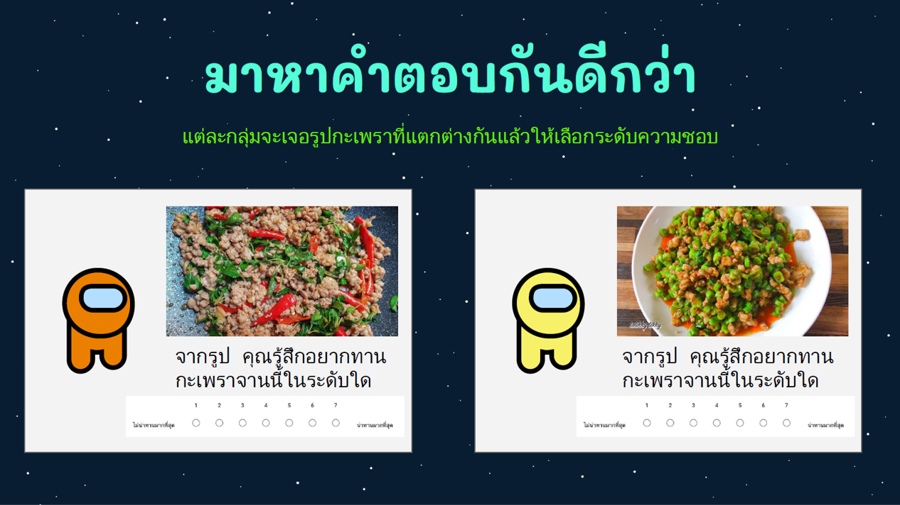

# A/B Testing
  

## Overview
Conduct an A/B Testing by Survey method on Pad-Kra-Prao (Thai dish) with or without Long Beans.  
There has been a controversy in recent years over "Pad-Kra-Prao should not have Long Beans". Let's say this is the same as whether or not Pizzas with/without Pineapples 😆  

## Dataset 📊  
We prepared 2 types of Google Forms with exactly the same questions except the images of Pad-Kra-Prao with (A) or wihout (B) Long Beans.
The dish image is displayed right at the question asking "How likely do you want to have this dish?" with a 7-scale response.  

## Result
Yes, Pad-Kra-Prao without Long Beans for the win.  