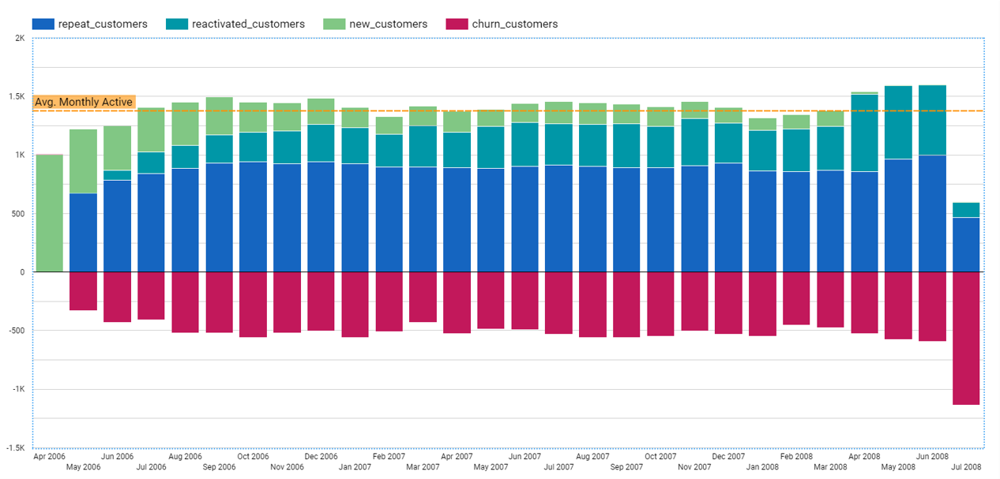

# Customer Movement Analysis
    
The monthly report the numbers of customers categorized into 4 groups, New, Repeat, Reactivated, and Churn, in order to see the changes in the customers for each month.

## Dataset 📊  
Supermarket, the same data as used in Customer Segmentation homework.

## Data Preparation
Since the data was already imported into BigQuery from the previous work, use the sql script to prepare the data for visualization.  
**SQL:** [customer-movement-prep.sql](./customer-movement-prep.sql)  

For each reporting month, customers are grouped into 4 categories defined by the defition below  

| Status | Current | Previous | Before |
| --- | :---: | :---: | :---: |
| Repeat | ✅ | ✅ | |
| Reactivated | ✅ | ❌ | ✅ |
| New | ✅ | ❌ | ❌ |
| Churn | ❌ | ✅ | |
  
**Current:** made purchases this month (M)  
**Previous:** made purchases last month (M-1)  
**Before:** made purchases before last month (< M-1)  

## Result
The visualization can be made right after executing the SQL using *Google Data Studio*.

