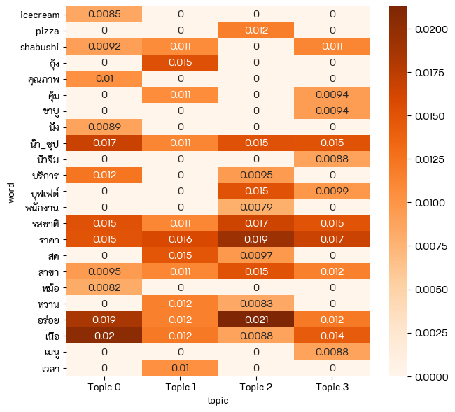
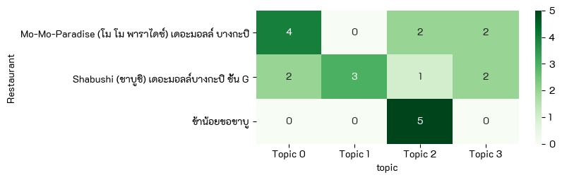
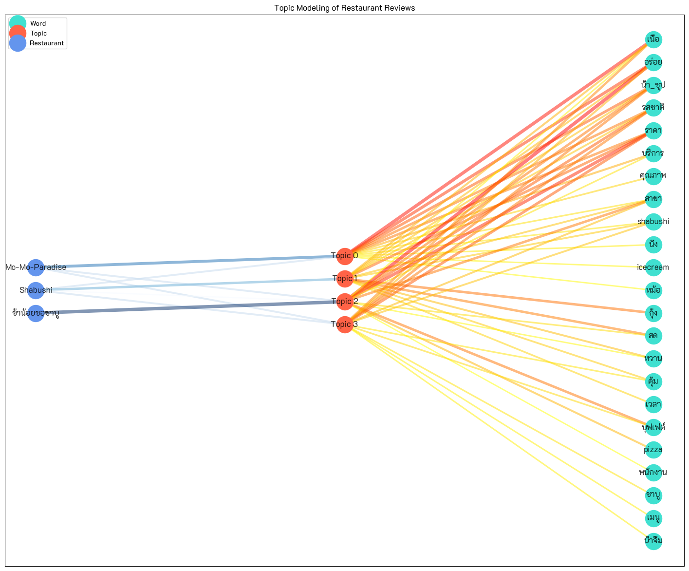

# Voice of Customers
      

## Dataset 📊  
Customer reviews of 3 restaurants from Wongnai - only 21 instances.  

**Notebooks:** [Voice of Customers](./hw11-voice-of-customers.ipynb)  
**Google Colab:**   

## Data Preparation
TBD  

## Result
  
  
  
